# trainer app with admin (Manager) app

### its related to the tournament app 
- Coaches Signin with trainer app and add 13 players
- manager can see this coaches details and add tournaments and sport types the coaches thats added teams on tournament base and sport types   admin pplannig a match according to this and also by teams gender and weights

* 📱 `to See Admin App Switch Admin App Branch`
* 📱 `to See Trainer App Switch Main Branch`

 ```bash
    Storage: Firebase
 ```


## Trainer & Admin: AppIcon


- 1. Admin ScreenShots
  <table style='border:none;width:100%'>
    <td style='width:24%;'>
    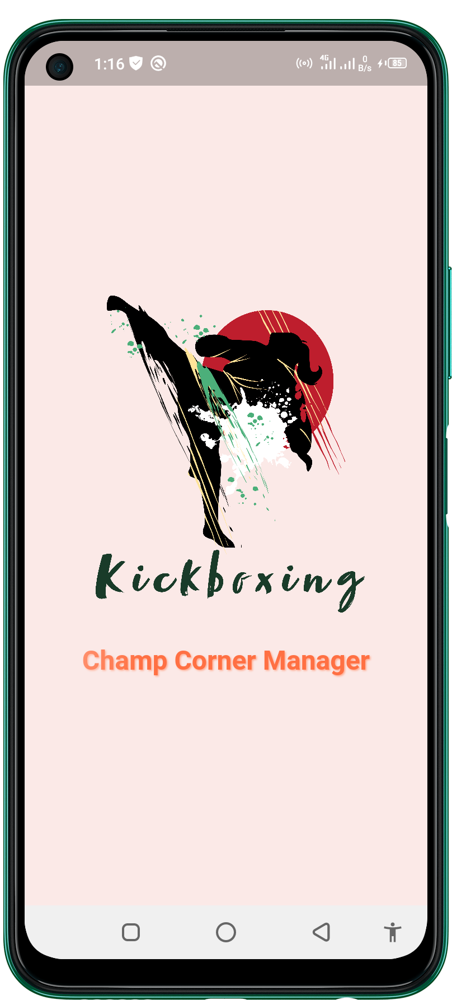
    </td>
    <td style='width:24%;'>
    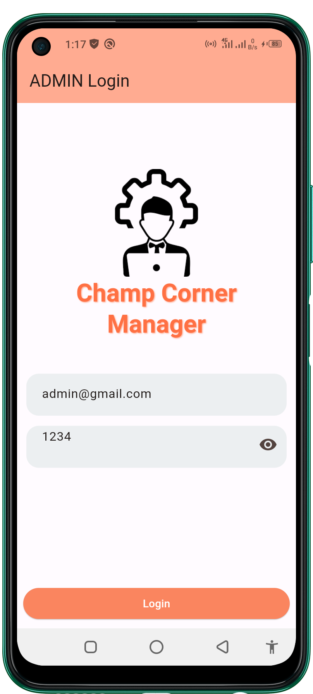
    </td>
    <td style='width:24%;'>
    
    </td>
    </td>
    <td style='width:24%;'>
    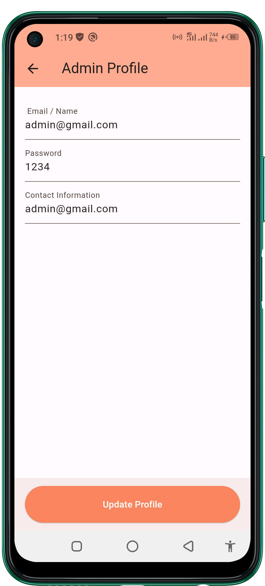
    </td>
  </table>
  <table style='border:none;width:100%'>
    <td style='width:24%;'>
    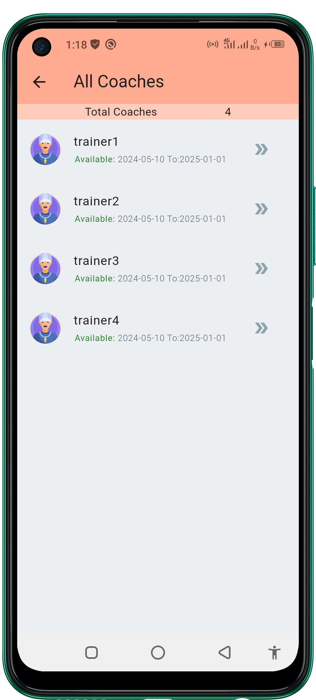
    </td>
    <td style='width:24%;'>
    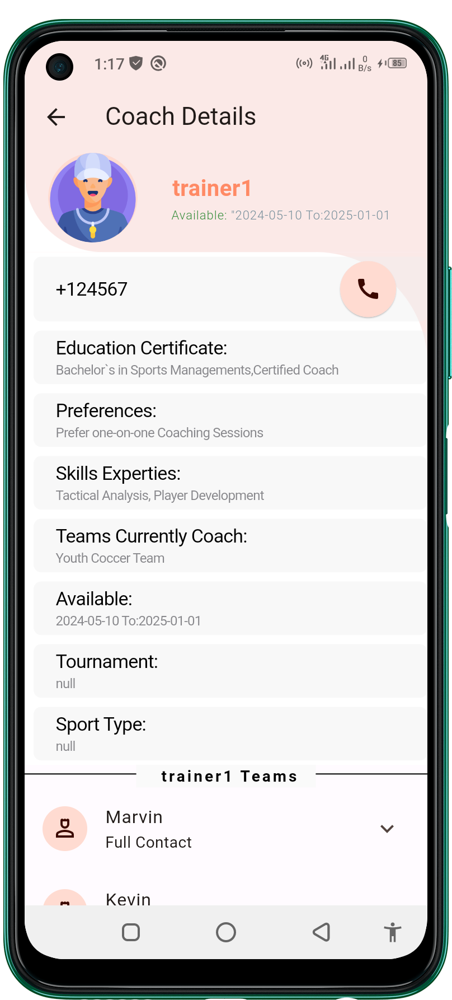
    </td>
    <td style='width:24%;'>
    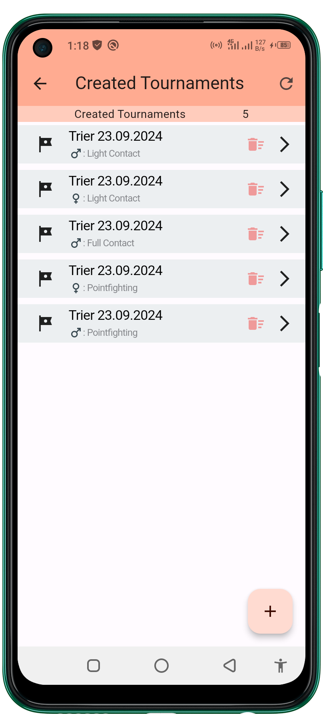
    </td>
    </td>
    <td style='width:24%;'>
    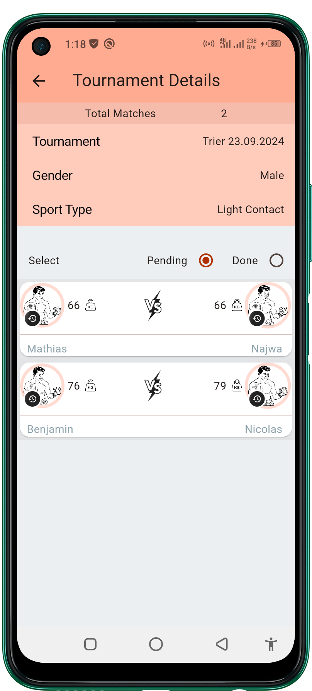
    </td>
  </table>
  <table style='border:none;width:100%'>
    <td style='width:19%;'>
    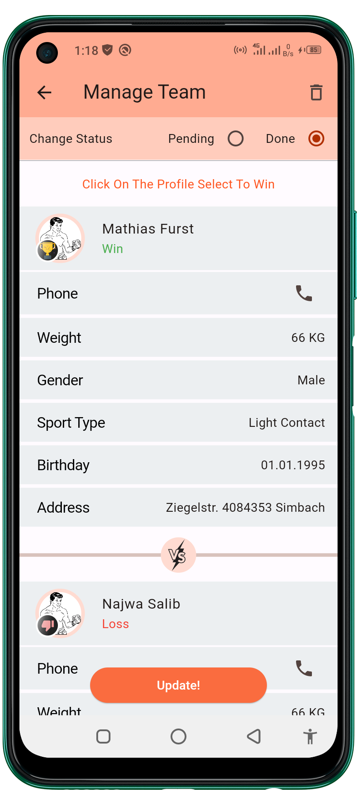
    </td>
    <td style='width:19%;'>
    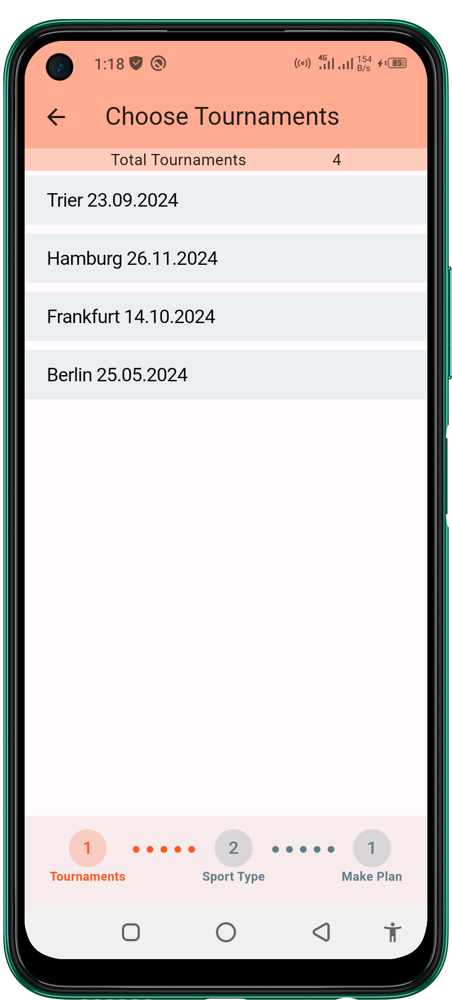
    </td>
    <td style='width:19%;'>
    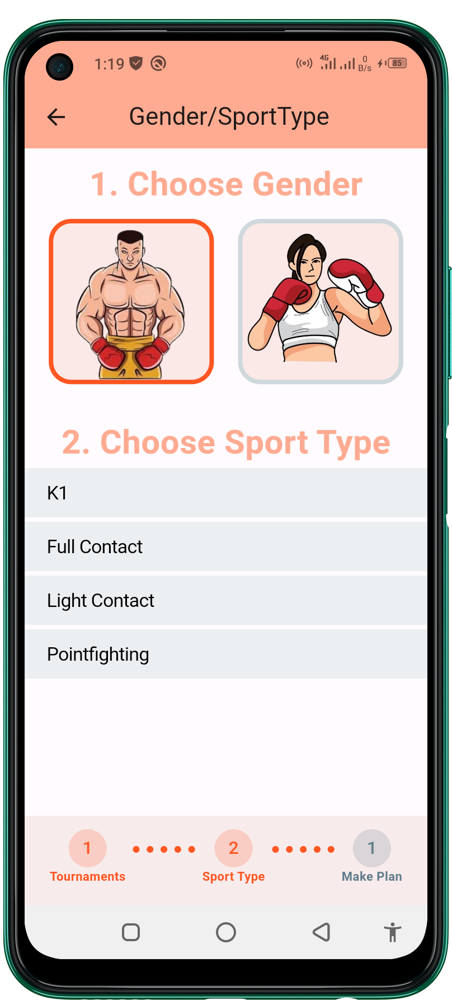
    </td>
    </td>
    <td style='width:19%;'>
    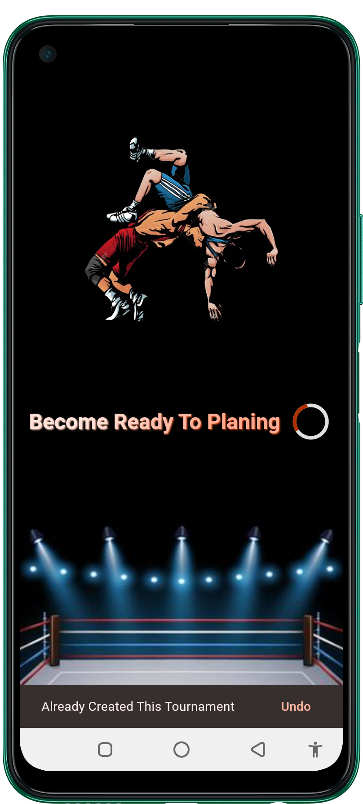
    </td>
    <td style='width:19%;'>
    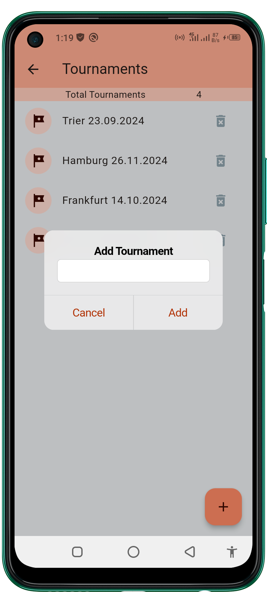
    </td>
  </table>

- 2. Trainer ScreenShots
  <table style='border:none;width:100%'>
    <td style='width:24%;'>
    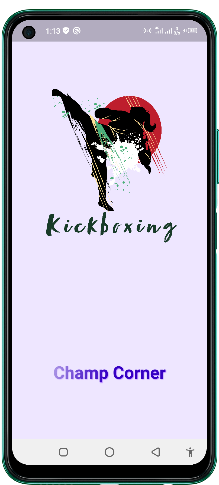
    </td>
    <td style='width:24%;'>
    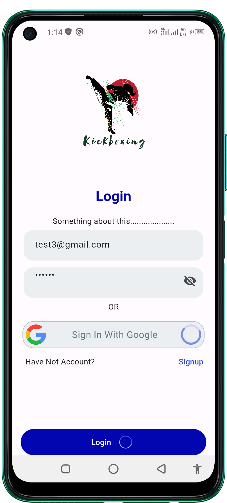
    </td>
    <td style='width:24%;'>
    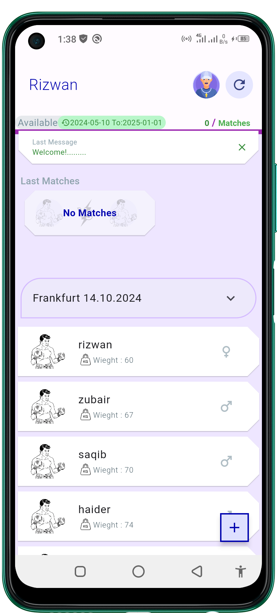
    </td>
    </td>
    <td style='width:24%;'>
    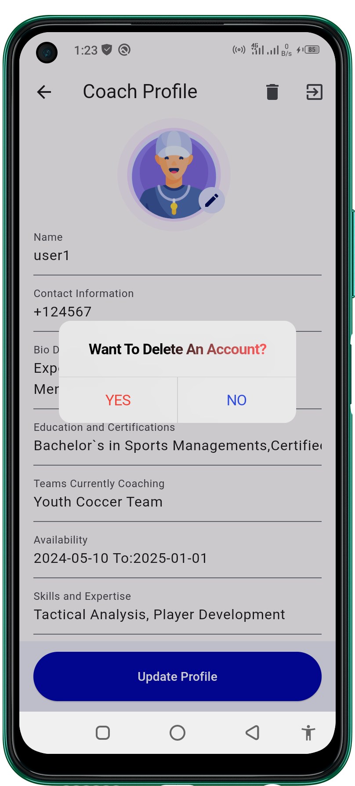
    </td>
  </table>
  <table style='border:none;width:100%'>
    <td style='width:24%;'>
    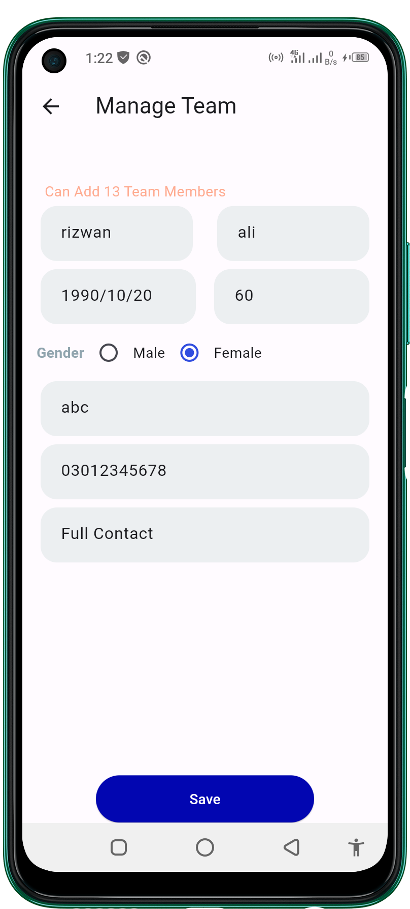
    </td>
    <td style='width:24%;'>
    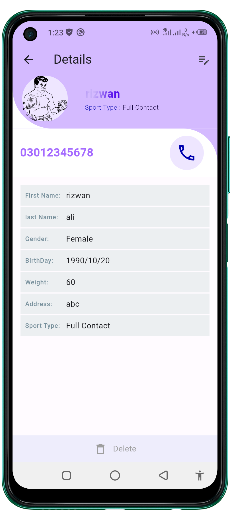
    </td>
    <td style='width:24%;'>
    
    </td>
    </td>
    <td style='width:24%;'>
    
    </td>
  </table>